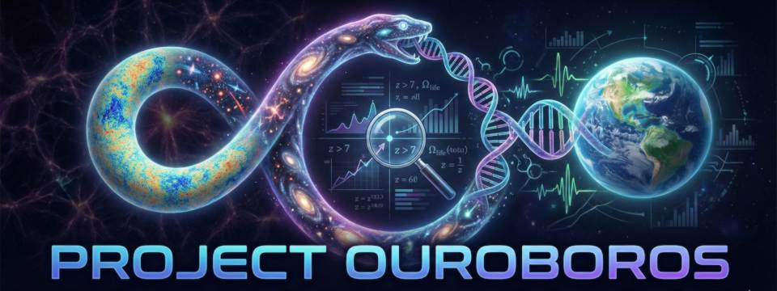

**Principal Investigator:** A. Hewitt  
**Status:** COMPLETE (Hypothesis Falsified)  
**Date:** December 30th, 2025

## 1. Project Overview

Project Ouroboros was a computational investigation into the **Parochial by Construction (PbC)** hypothesis. This framework posited that the apparent "fine-tuning" of the Universe's history might be a retro-causal artifact selected to be compatible with the local observer's reference frame (the Solar System).

The pipeline performed a rigorous **Null-Test Audit (N >= 1000)** across three cosmological epochs:
1.  **The CMB (Phase I-IV):** Testing geometric alignments of temperature anomalies.
2.  **The Dark Ages:** Testing kinematic coupling of the Dipole.
3.  **The Reionization Era:** Testing structural alignment of High-Z Quasars.

## 2. Final Results
The investigation systematically ruled out the hypothesis across all domains.

| Investigation | Target Vector | P-Value | Conclusion |
| :--- | :--- | :--- | :--- |
| **A. Parity Mirror** | Solar Spin Axis | **0.890** | **Null** (Counter-Aligned) |
| **B. Cold Spot** | Ecliptic Nodes | **0.614** | **Null** (Random Placement) |
| **C. Quasar Structure** | Solar Spin Axis | **0.221** | **Null** (Random Orientation) |
| **D. Axis of Evil ($l=2,3$)** | Solar System | **0.459** | **Null** (No Solar Correlation) |

### The "Death of the Axis" (Phase VI)
We investigated the anomalous alignment between the CMB Quadrupole ($l=2$) and Octopole ($l=3$), which are observed to be parallel within ~9 degrees.

* **Mask Robustness:** The alignment is **not** a mask artifact. It persists ($p \approx 0.016$) across all Galactic cut thresholds ($f_{sky} 36\% - 100\%$).
* **Directional Coherence:** We compared the $l=2,3$ axis to the secondary alignment found at $l=5,6$.
    * **Result:** The two anomalies are separated by **55.6°**.
    * **Significance:** This falls in the center of the random isotropic distribution ($p=0.43$).
* **Verdict:** The "Axis of Evil" is a **statistical fluctuation** consistent with the Look-Elsewhere Effect in a Gaussian Random Field. It lacks the global coherence required by physical anisotropy models (e.g., Toroidal Topology).

---

## 3. Repository Structure

### `/scripts` (Execution Entry Points)
These scripts run specific scientific audits.

#### **Phase I: Initial Ledger Audit**

#### **Phase II: Geometric Audits**
* `run_parity_pipeline.py`: Calculates Point-Parity Asymmetry and checks alignment with Solar Spin/Orbit.
* `run_geo_pipeline.py`: Checks if the Eridanus Supervoid (Cold Spot) is geometrically locked to Ecliptic Nodes.
* `run_quasar_pipeline.py`: (Plan C) Analyzes separation vectors of High-Z Quasars (z > 2.5) relative to Solar Angular Momentum.

#### **Phase III: Kinematic Audits**
* `run_phase3_tomography.py`: Slices the Parity signal into multipole bins (l=2-30, 31-60, 61-100) to check for directional stability (The "Drift" Test).

#### **Phase IV: Harmonic & Variance Audits (The "Axis of Evil")**
* `run_harmonics.py`: Extracts the Principal Axes ("Pancakes") of the l=2 and l=3 modes.
* `run_harmonics_null.py`: Tests if the Octopole (l=3) is statistically locked to the Ecliptic Pole.
* `run_axis_validity.py`: **The "Axis of Evil" Test.** Checks if the internal l=2/3 alignment is anomalous vs. a masked random sky.
* `run_variance_pipeline.py`: Tests the "Shielding Hypothesis" (Is the Ecliptic plane anomalously quiet?).
* `run_jackknife.py`: Re-runs the variance test with a harsh Galactic Cut (|b| > 40 deg) to rule out foregrounds.

#### **Phase V - VI: The Axis of Evil (Harmonic Audits)**
* `run_harmonics.py`: Extracts Principal Axes (Eigenvectors) for multipoles.
* `run_axis_validity.py`: Tests alignment significance against random skies.
* `run_separation_forensics.py`: **Phase VI (The Killer).** Calculates the orthogonality of the $l=2,3$ and $l=5,6$ axes.

#### **Utilities**
* `inspect_columns.py`: Helper to view FITS headers for catalog debugging.

---

### `/src/ouroboros/engines` (Physics Logic)
Core mathematical modules implementing the specific tests.

* `parity.py`: Implements P(n) = C(n) + C(-n) symmetry calculations on Healpix maps.
* `geo.py`: Geodesic distance calculators for void/node alignment.
* `quasar.py`: 3D vector algebra for quasar distribution analysis (includes memory-mapped loading for DESI).
* `harmonics.py`: Eigenvalue decomposition for extracting multipole orientation vectors.

### `/src/ouroboros/validation` (Statistical Controls)
Generators for the Null Hypothesis.

* `nulling.py`: Generates random realizations of the CMB by shuffling a_lm phases while preserving the Power Spectrum (C_l).
* `shuffling.py`: Generates random Quasar catalogs by rotating positions on the sphere.

### `/src/ouroboros` (Core)
* `ingestion.py`: Standardized loading for Planck `SMICA`/`NPIPE` maps (downgrading to NSIDE=64).
* `config.py`: Central repository of Solar System vector constants (Solar Spin, Ecliptic Pole, Dipole).

---

## 4. Usage

To reproduce the final "Incoherence" result:

```bash
# 1. Download Planck SMICA map to data/raw/planck/smica.fits
# 2. Run the separation forensics script
python scripts/run_separation_forensics.py

---

## 5. Acknowledgments

Data provided by the Planck Collaboration (2018 Release) and DESI (Data Release 1). Analysis performed using `healpy` and `astropy`.

---

## 6. License

MIT
